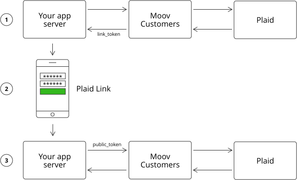
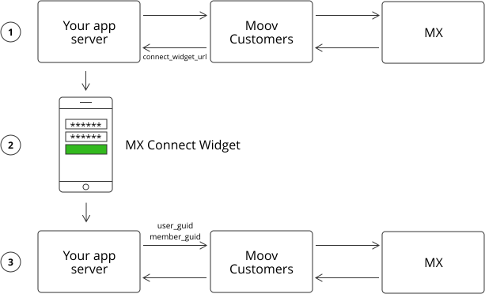

# Account Validation

This project supports the following strategies and vendors to validate accounts:

* micro-deposits validation with Moov [PayGate](#micro-deposits-validation-with-moov-paygate)
* instant validation with [Plaid](#instant-validation-with-plaid)
* instant validation with [MX](#instant-validation-with-mx)

For details on the account validation API, check the [API reference](https://moov-io.github.io/customers/api/#post-/customers/{customerID}/accounts/{accountID}/validations).

For more information on how instant account validation works, read [What is Instant Account Validation](https://www.mx.com/moneysummit/what-is-instant-account-verification)

## Micro-deposits Validation with Moov PayGate

In order to validate an account, two micro-deposits under $0.50 will be transferred to the customer's bank account.

To use this strategy, [configure PayGate](./configuration.md#paygate) and follow the steps below:

### 1. Initiate Account Validation

In this step, Moov Customers creates two micro-deposits for the account through Moov [Paygate](https://github.com/moov-io/paygate).

Here is an example of an API call to initiate account validation:
```shell
curl -X POST "http://localhost:8087/customers/51dd8cdd/accounts/b74d7c51/validations" \
 -H "Accept: application/json, application/json" \
 -H "X-Organization: org342" \
 -H "Content-Type: application/json" \
 -d '{
        "strategy":"micro-deposits",
        "vendor":"moov"
     }' 
```

### 2. Complete Account Validation

To complete account validation, values of created micro-deposits should be provided in the following API call:
```shell
curl -X PUT "http://localhost:8087/customers/51dd8cdd/accounts/b74d7c51/validations" \
 -H "Accept: application/json, application/json" \
 -H "X-Organization: org342" \
 -H "Content-Type: application/json" \
 -d '{
         "strategy":"micro-deposits",
         "vendor":"moov",
         "vendor_request":{
            "micro-deposits":[
               "USD 0.03",
               "USD 0.07"
            ]
         }
      }' 
```

## Instant Validation with Plaid

Moov Customers is integrated with [Plaid Auth](https://plaid.com/products/auth/) allowing our users to instantly authenticate bank accounts for payments and set up ACH transfers. Check out the [configuration guide](./configuration.md#Plaid) for setting up account validation with Plaid.

### How it Works

Moov Customers interacts with Plaid's API after you have configured and added [Plaid Link](https://plaid.com/docs-beta/link/) to your application or website. Plaid Link is a drop-in module that provides a secure authentication flow for financial institutions supported by Plaid. Plaid Link makes it easy for users to securely connect their bank accounts to Plaid.

The diagram below shows how account verification with Plaid works:



1. Make a request to initiate account validation and get a `link_token` for Plaid Link from the response.
2. Open Plaid Link using the `link_token` for your customer.
3. Make a request to complete account validation by providing a `public_token` from Plaid Link in the `onSuccess` callback.

### 1. Initiate Account Validation

Here is an example of the API call to initiate account validation:

```shell
curl -X POST "http://localhost:8087/customers/51dd8cdd/accounts/b74d7c51/validations" \
 -H "Accept: application/json, application/json" \
 -H "X-Organization: org342" \
 -H "Content-Type: application/json" \
 -d '{
        "strategy":"instant",
        "vendor":"plaid"
     }' 
```

The response contains the `link_token` used to open Plaid Link:

```json
{
  "vendor_response":{
    "link_token":"link-sandbox-32771002-45e1-4f9b-93fd-xxxxx",
    "expiration":"2020-08-25T13:07:19Z"
  }
}
```

### 2. Open Plaid Link

See more details on the [Plaid Link documentation website](https://plaid.com/docs-beta/link/). Here we provide a simplified example of how Plaid Link may be used:

```html
<html>
<body>
	<button id="link-button">Verify Account with Plaid</button>
	<script src="https://cdnjs.cloudflare.com/ajax/libs/jquery/2.2.3/jquery.min.js"></script>
	<script src="https://cdn.plaid.com/link/v2/stable/link-initialize.js"></script>
	<script type="text/javascript">
		var handler;

		// 1. send POST request to your app server (e.g., /verify)
		$.post('/verify', {}, function (data) {
			// 2. Open Plaid Link with link_token from Moov Customers
			handler = Plaid.create({
				token: data.link_token,
				onSuccess: function (public_token) {
					// 3. send public_token your app server
					$.ajax({
						type: "PUT",
						url: "/verify",
						data: {
							public_token: public_token,
						},
						success: function (data) {
							console.log("Verification result: ", data);
						},
					});
				},
			});
		});

		$('#link-button').on('click', function (e) {
			handler.open();
		});
	</script>
</body>
</html>
```

### 3. Complete Account Validation

When you get `public_token` to your app server from Plaid Link, you can complete account validation by making an API request to Moov Customers. Here is an example:

```bash
curl -X PUT "http://localhost:8087/customers/51dd8cdd/accounts/b74d7c51/validations" \
 -H "Accept: application/json, application/json" \
 -H "X-Organization: org342" \
 -H "Content-Type: application/json" \
 -d '{
        "strategy":"instant",
        "vendor":"plaid",
        "vendor_request":{
           "public_token":"public-sandbox-59eb4718-93d8-41a0-a338-000000000000"
        }
     }' \
```

The response with validation result:

```json
{
  "vendor_response":{
    "result":"validated"
  }
}
```
## Instant Validation with MX

Moov Customers is integrated with the [MX Platform API](https://www.mx.com/products/platform-api/) which allows our users to instantly authenticate bank accounts for payments and set up ACH transfers. Check out the [configuration guide](./configuration.md#MX-Atrium) for setting up account validation with MX.

### How it Works

Moov Customers interacts with the MX Platform API after you have configured and added [MX Connect widget](https://atrium.mx.com/docs#mx-connect-widget) by embedding it in a [website with an iframe](https://atrium.mx.com/docs#embedding-in-a-website) or a mobile application with a [WebView](https://atrium.mx.com/docs#embedding-in-webviews). MX Connect is a ready-made and embeddable application that allows you to quickly perform account verification of your customers.

The diagram below shows how account verification with MX works:



1. Make a request to initiate account validation and get a `connect_widget_url` for the MX Connect widget from the response.
2. Open MX Connect for your customer.
3. Make request to complete account validation by providing `user_guid` and `member_guid` from MX Connect in the `onSuccess` callback.

### 1. Initiate Account Validation

Here is an example of the API call to initiate account validation:

```bash
curl -X POST "http://localhost:8087/customers/51dd8cdd/accounts/b74d7c51/validations" \
 -H "Accept: application/json, application/json" \
 -H "X-Organization: org342" \
 -H "Content-Type: application/json" \
 -d '{
        "strategy":"instant",
        "vendor":"mx"
     }' 
```

The response contains `connect_widget_url` used to open MX Connect:

```json
{
  "vendor_response":{
    "connect_widget_url":"https://int-widgets.moneydesktop.com/xxxxxx"
  }
}
```

### 2. Open MX Connect Widget

Find more details on [how to setup and configure MX Connect](https://atrium.mx.com/docs#mx-connect-widget). Here we provide a simplified example of how MX Connect widget may be used:

```html
<html>
<body>
	<button id="link-button">Verify Account with MX</button>
	<p>Select MX bank and use test_atrium/password or test_atrium/challenge with "correct" as MFA answer</p>
	<div id="verifyAccount"></div>
	<script src="https://cdnjs.cloudflare.com/ajax/libs/jquery/2.2.3/jquery.min.js"></script>
	<script src="https://atrium.mx.com/connect.js"></script>
	<script type="text/javascript">
		var handler;

		// 1. send POST request to your app server (e.g., /verify)
		$.post('/verify', {}, function (data) {
			console.log(data, data.connect_widget_url);

			// 2.1 Configure MX Connect Widget
			handler = new MXConnect({
				config: {
					is_mobile_webview: false,
				},
				id: "verifyAccount",
				url: data.connect_widget_url,
				onSuccess: function (data) {
					// 3. send data including user_guid and memeber_guid to your app server
					$.ajax({
						type: "PUT",
						url: "/verify",
						data: data,
						success: function (data) {
							console.log("Verification result: ", data);
						},
					});
				},
			});
		});

		$('#link-button').on('click', function (e) {
			// 2.2 Open MX Connect Widget
			handler.load();
		});
	</script>
</body>
</html>
```

### 3. Complete Account Validation

When you get `user_guid` and `member_guid` to your app server from MX Connect, you can complete account validation by making an API request to Moov Customers. Here is an example:

```bash
curl -X PUT "http://localhost:8087/customers/51dd8cdd/accounts/b74d7c51/validations" \
 -H "Accept: application/json, application/json" \
 -H "X-Organization: org342" \
 -H "Content-Type: application/json" \
 -d '{
        "strategy":"instant",
        "vendor":"mx",
        "vendor_request":{
           "user_guid":"USR-d6a55e69-8711-4b21-b594-2538551231231",
           "member_guid":"MBR-1c38dad9-e699-4f01-baf7-d91231231231"
        }
     }' \
```

The response with validation result

```json
{
  "vendor_response":{
    "result":"validated"
  }
}
```
